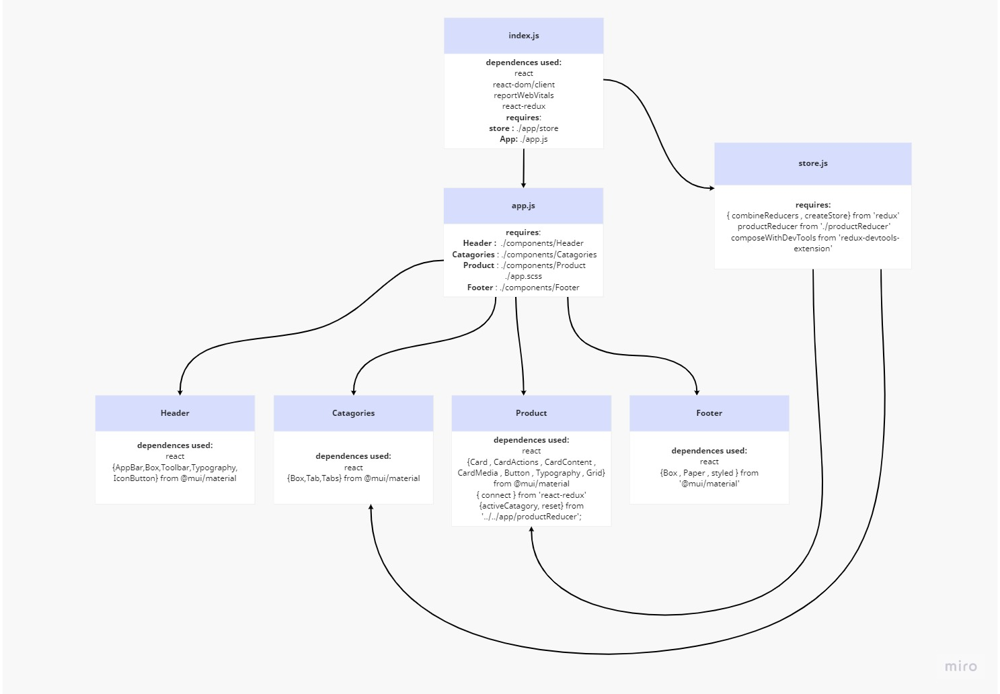

# storefront

Our application will power an online storefront that will allow our users to browse our product offerings by category, place items in their shopping cart, and check-out when they are ready to make their purchase 

## Technical Requirements
The application will be created with the following overall architecture and methodologies

1. React
2. ES6 Classes
3. Redux Store for Application State
4. Deployed API with Mongo storage for storing categories and products
5. Superagent or Axios for performing API Requests
6. Material UI for layout and styling
7. Test Driven Development, using Jest
8. Deployment to a cloud provider (Netlify, Amplify, or GitHub Pages)

## Phase 1: Application Setup

- Basic React Application

- Redux State Management

- State managed in memory

- Material UI Components & Styling

## Phase 2: Shopping Cart

- Add items to a shopping cart

- Update quantities

- Remove items from the cart

- Show the cart in real-time on the UI

## Phase 3: Live Data

- Connect the application a live API

- Persist changes to products based on cart activity.

## Phase 4: Checkout & Detail Pages

- Refactor the store to use the latest

- Redux design pattern (Redux Toolkit)

- Add a cart checkout page

- Add a product details page

## UML Diagram :

 

 

## [Deployed Link](https://6310de57ee0c622078906c9b--kaleidoscopic-shortbread-798f5e.netlify.app/)
